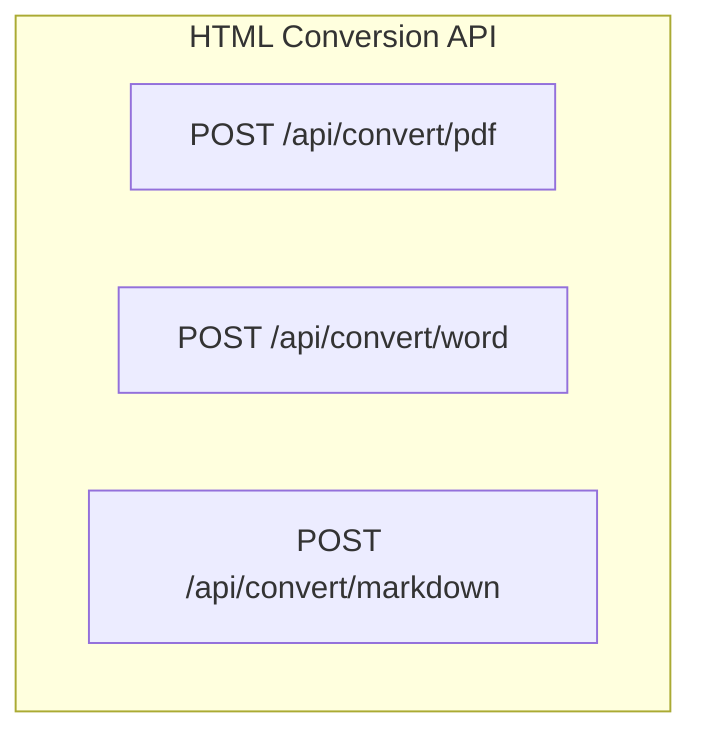
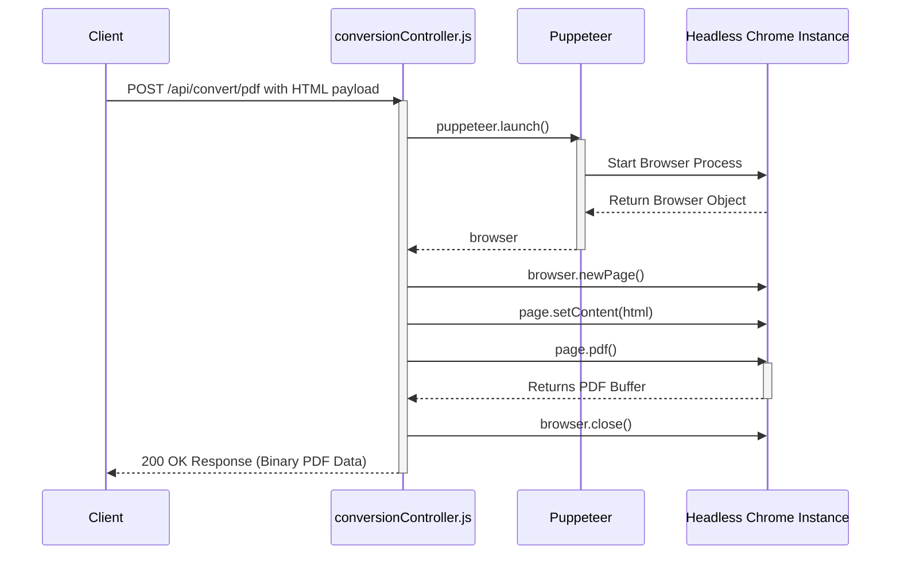
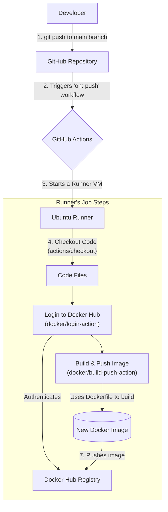

# HTML Conversion API

<p align="center">
  <a href="https://github.com/Hemanth0411/html-conversion-api/actions/workflows/deploy.yml">
    
  </a>
  <a href="https://hub.docker.com/r/hemanth0411/html-conversion-api">
    
  </a>
</p>

A simple, containerized REST API service to convert HTML content into PDF, Word (.docx), and Markdown documents, built with Node.js and Puppeteer.

---

## About The Project

This service provides a straightforward API for server-side file conversion. It solves the common problem of needing to generate documents from dynamic HTML content without relying on client-side libraries.

The entire application is containerized in Docker, making it portable, scalable, and easy to deploy in any environment. It includes an automated CI/CD pipeline using GitHub Actions that builds and pushes the latest stable version to Docker Hub.

### Key Features

-   Convert HTML to high-fidelity PDF using a real browser engine (Chromium).
-   Convert HTML to Microsoft Word (.docx).
-   Convert HTML to Markdown.
-   Simple, RESTful API interface.
-   Fully containerized and ready for deployment.
-   Automated build and publish pipeline.

---

## Technology Stack

*   **Backend:** [Node.js](https://nodejs.org/)
*   **Framework:** [Express.js](https://expressjs.com/)
*   **HTML to PDF:** [Puppeteer](https://pptr.dev/) (Headless Chrome)
*   **HTML to Word:** [html-to-docx](https://www.npmjs.com/package/html-to-docx)
*   **Containerization:** [Docker](https://www.docker.com/) & [Docker Compose](https://docs.docker.com/compose/)
*   **CI/CD:** [GitHub Actions](https://github.com/features/actions)

---

---

## Architecture and Workflows

This section provides a visual overview of the project's architecture, API request flow, and the CI/CD pipeline.

### 1. High-Level Blueprint

This diagram shows the overall structure of the API, with the available endpoints that a client application can interact with.



### 2. Endpoint-Specific Flow (PDF Conversion)

This sequence diagram details the internal steps that occur when a request is made to the `/api/convert/pdf` endpoint. It shows how the controller uses Puppeteer to interact with a headless Chrome instance.



### 3. CI/CD Automation Pipeline

This diagram illustrates the automated workflow managed by GitHub Actions. Every push to the `main` branch triggers this pipeline, resulting in a new, updated Docker image being published to Docker Hub.


---

## Getting Started

There are three ways to run this service.

### Option 1: Run with Pre-built Docker Image (Recommended)

This is the fastest way to get the service running.

1.  Pull the latest image from Docker Hub:
    ```bash
    docker pull hemanth0411/html-conversion-api:latest
    ```

2.  Run the container:
    ```bash
    docker run --rm -p 8080:8080 hemanth0411/html-conversion-api:latest
    ```

The API will now be running and available at `http://localhost:8080`.

### Option 2: Build and Run with Docker Compose

This method is ideal for developers who want to modify the code.

1.  **Authenticate with GitHub Container Registry:** The project's base image (`ghcr.io/puppeteer/puppeteer`) requires authentication. You need a Personal Access Token (PAT) with the `read:packages` scope. Follow the [official guide to create a PAT](https://docs.github.com/en/authentication/keeping-your-account-and-data-secure/managing-your-personal-access-tokens).

2.  Log in via your terminal:
    ```bash
    # Replace YOUR_PAT and YOUR_GITHUB_USERNAME
    export CR_PAT=YOUR_PERSONAL_ACCESS_TOKEN
    echo $CR_PAT | docker login ghcr.io -u YOUR_GITHUB_USERNAME --password-stdin
    ```

3.  Clone the repository and run the service:
    ```bash
    git clone https://github.com/Hemanth0411/html-conversion-api.git
    cd html-conversion-api
    docker-compose up --build
    ```

### Option 3: Run Locally with Node.js (For Development)

This method is for development and requires Node.js and `npm` installed on your machine. Note: This does **not** use Docker.

1.  Clone the repository:
    ```bash
    git clone https://github.com/Hemanth0411/html-conversion-api.git
    cd html-conversion-api
    ```
2.  Install dependencies:
    ```bash
    npm install
    ```
    *(This will download a local version of Chromium, which can be a large download.)*

3.  Start the server:
    ```bash
    node src/app.js
    ```
The API will be available at `http://localhost:8080`.

---

## API Endpoints

### Convert HTML to PDF

-   **URL:** `/api/convert/pdf`
-   **Method:** `POST`
-   **Body (raw JSON):**
    ```json
    {
      "html": "<h1>Hello PDF</h1><p>This is your content.</p>"
    }
    ```
-   **Success Response:**
    -   **Code:** `200 OK`
    -   **Content:** The binary data of the PDF file (`Content-Type: application/pdf`).

### Convert HTML to Word

-   **URL:** `/api/convert/word`
-   **Method:** `POST`
-   **Body (raw JSON):**
    ```json
    {
      "html": "<h1>Hello Word</h1><p>This is your content.</p>"
    }
    ```
-   **Success Response:**
    -   **Code:** `200 OK`
    -   **Content:** The binary data of the `.docx` file (`Content-Type: application/vnd.openxmlformats-officedocument.wordprocessingml.document`).

### Convert HTML to Markdown

-   **URL:** `/api/convert/markdown`
-   **Method:** `POST`
-   **Body (raw JSON):**
    ```json
    {
      "html": "<h1>Hello Markdown</h1><p>This is your content.</p>"
    }
    ```
-   **Success Response:**
    -   **Code:** `200 OK`
    -   **Content:** The converted Markdown as plain text (`Content-Type: text/markdown`).

## License

The source code for this project is licensed under the **[MIT License](LICENSE)**.

This project utilizes the official Puppeteer Docker image (`ghcr.io/puppeteer/puppeteer`) as its base. The license for the base image and the Puppeteer library is **Apache 2.0**. A full copy of the Apache 2.0 license and the required attributions are available in the **[NOTICE](NOTICE)** file.